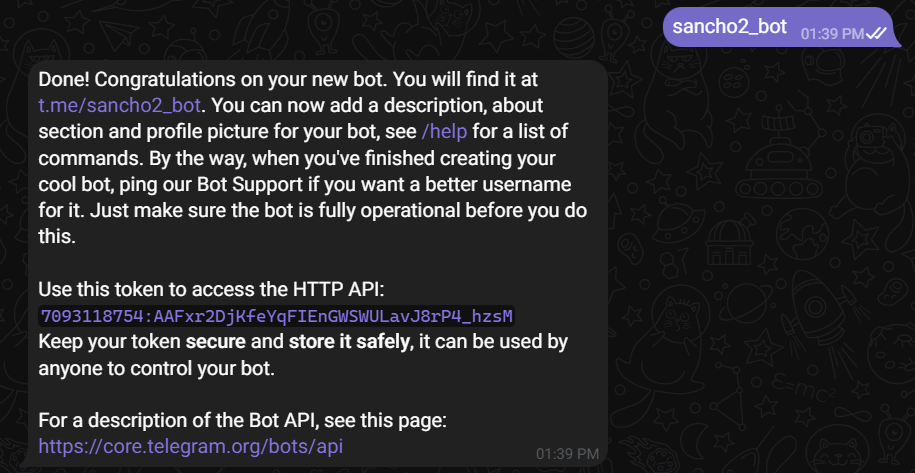
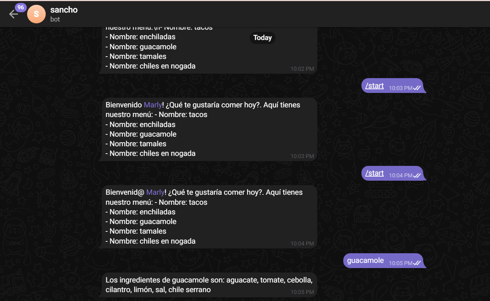

# Creación de un bot de Telegram en Python

## Configuración inicial

1. Instala Python en tu sistema si aún no lo has hecho.
2. Instala la librería `python-telegram-bot` utilizando pip:
   ```
   pip install python-telegram-bot
   ```
3. Crea una cuenta en Telegram si aún no la tienes.
4. Busca el bot llamado BotFather en Telegram y sigue las instrucciones para crear un nuevo bot.
5. Guarda el token que te proporciona BotFather.

¡Espero que esto te ayude! Si necesitas más ayuda con los siguientes pasos, ¡no dudes en pedirla!

# Creación de un Bot de Telegram para Consultar Menú de Comidas

El bot permite a los usuarios ver el menú disponible y obtener información sobre los ingredientes de cada plato.

## Configuración Inicial

1. *Importaciones*: Se importan los módulos necesarios, incluyendo logging para el registro de eventos, re para expresiones regulares y clases específicas de la librería python-telegram-bot.

2. *Expresión Regular*: Se define una expresión regular para detectar mensajes que contienen palabras clave relacionadas con la comida, como "menu", "comida" o "plato".

3. *Menú de Comidas*: Se crea un diccionario llamado menu_comidas, que contiene una lista de platos de comida como claves y una lista de ingredientes como valores asociados.

### Explicación de la Expresión Regular

La expresión regular se utiliza en Python con la biblioteca `re` para buscar coincidencias de un patrón en una cadena de texto. La expresión regular en cuestión se utiliza dentro de una condición `if` para verificar si la variable `message_text` contiene la palabra almacenada en la variable `comida`.

```python
if re.search(rf"\b{comida}\b", message_text):
    comida_encontrada = comida
    break
```

- `rf"\b{comida}\b"`: Aquí se utiliza una cadena de formato (`f-string`) junto con una expresión regular. Veamos los componentes:
  - `\b`: Este es un delimitador de límite de palabra, que coincide con el inicio o el final de una palabra.
  - `{comida}`: Esta es una variable que contiene el nombre de la comida que estamos buscando.
  - `\b`: Otro delimitador de límite de palabra para asegurarse de que coincida con una palabra completa.
  - `r`: Este prefijo antes de la cadena de formato (`f-string`) indica que la cadena es una cadena de texto cruda, lo que significa que los caracteres especiales dentro de ella no son tratados como tales.

La expresión regular busca la palabra almacenada en la variable `comida` en el texto almacenado en la variable `message_text`, asegurándose de que coincida como una palabra completa utilizando los delimitadores `\b`. Si se encuentra la palabra, se asigna a `comida_encontrada` y el bucle se interrumpe. 

## Funcionalidades del Bot

### Comando /start

- *Función start()*: Esta función envía un mensaje de bienvenida al usuario cuando emite el comando /start. Muestra el menú de comidas disponibles.

### Comando /help

- *Función help_command()*: Responde al usuario proporcionando información sobre cómo utilizar el bot.

### Búsqueda de Comida

- *Función buscar_comida()*: Esta función busca la comida solicitada por el usuario en el mensaje utilizando expresiones regulares. Si encuentra la comida en el menú, responde con los ingredientes correspondientes. Si no la encuentra, envía un mensaje indicando que no tiene información sobre esa comida.

## Ejecución del Bot

- *Función main()*: Inicia el bot, configurando la aplicación de Telegram y agregando los manejadores de comandos y mensajes. Finalmente, ejecuta el bot en modo de escucha continua.

## Uso de Expresiones Regulares

- La expresión regular se utiliza en la función buscar_comida() para buscar coincidencias entre la comida solicitada por el usuario y los nombres de los platos en el menú. Esto garantiza una búsqueda precisa incluso si el usuario no escribe la palabra exacta del plato.

¡Con este bot, los usuarios pueden explorar el menú de comidas y obtener información detallada sobre los ingredientes de cada plato de manera rápida y sencilla!

## Conclusión
- La expresión regular utilizada en el código Python proporcionó una coincidencia específica de una palabra dentro de un texto utilizando patrones definidos. Al utilizar delimitadores de límite de palabra ( `\b`), garantiza que la coincidencia sea una palabra completa y no parte de una palabra más larga. Esta técnica es útil para procesar y analizar texto en busca de palabras clave o patrones específicos, lo que puede ser fundamental en diversas aplicaciones, como el procesamiento de lenguaje natural, la minería de texto o la validación de datos. La capacidad de utilizar expresiones regulares brinda a los desarrolladores una poderosa herramienta para manipular y trabajar con cadenas de texto de manera eficiente y precisa en aplicaciones Python. 

## Evidencia
 


